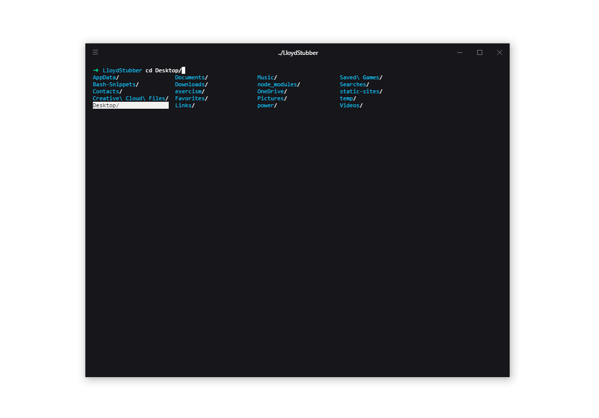

# My WSL Setup for Development
Quick rundown on my current setup  Windows Subsystem for Linux.

After a few headaches with running the Git Bash on Windows I’ve decided to move over the WSL for all development purposes. I’m very new to Linux so this is a very top-level overview so feel free to submit any changes.

Here’s a breakdown of how I got up and running below:



### Download & Install the WSL
- Follow the very thorough instructions [here](https://msdn.microsoft.com/en-au/commandline/wsl/install_guide)

### Get your terminal looking pretty pt.1
- Download Hyper.js [here](https://hyper.is/) - I went with the 'hyperblue' theme.

### Automatically open in Bash
- Open up Hyper and type `Ctrl` + `,`
- Scroll down to shell and change it to `C:\\Windows\\System32\\bash.exe`

### Install Zsh
- Run this `sudo apt-get install zsh`
- Open your bash profile `nano ~/.bashrc`
- Add this to set it to use ZSH as default:
```
if [ -t 1 ]; then
exec zsh
fi
```

### Get your terminal looking pretty pt.2
- Install Oh My Zsh with `sh -c "$(curl -fsSL https://raw.githubusercontent.com/robbyrussell/oh-my-zsh/master/tools/install.sh)"`
  - Read docs [here](https://github.com/robbyrussell/oh-my-zsh) on how to add more plugins and change themes (I went with their out of the box 'robbyrussell').

### Fix the ls and cd colours
Out of the box when you `ls` or `cd` + `Tab` you get some nasty background colours on the directories. To fix this, crack open your ~/.zshrc file and add this to the end:
```
#Change ls colours
LS_COLORS="ow=01;36;40" && export LS_COLORS

#make cd use the ls colours
zstyle ':completion:*' list-colors "${(@s.:.)LS_COLORS}"
autoload -Uz compinit
compinit
```

### Install Git
- Run this `sudo apt update`
- Then run `sudo apt install git`

### Setup a SSH key and link to your Github
- Follow the Linux steps [here](https://help.github.com/articles/generating-a-new-ssh-key-and-adding-it-to-the-ssh-agent/#platform-linux) to create a key and add it to your SSH agent
- Then type `cat ~/.ssh/id_rsa.pub`
- Copy your key from the terminal and paste it into your Github keys

### Install N (alternative to Node Version Manager)
My shell was running slow with nvm so I switched to [n](https://github.com/mklement0/n-install). Just install it with their curl command and if n doesn't work as a command on zsh, it would have installed it's path into your ~/.bashrc so just copy it over to your ~/.zshrc.

### Install Gulp CLI
- Follow the Gulp docs [here](https://github.com/gulpjs/gulp/blob/master/docs/getting-started.md).

### Aliases
Just to test out using aliases, I picked a few things I type a lot into the terminal that could save me some keystrokes. Add this to your .zshrc file to do the same and add anything else you see fit:
```
# aliases for git
alias add='git add -A'
alias status='git status'
alias push='git push -u origin master'
alias pull='git pull'
alias log='git log'
```

### Change default editor
Out of the box the default editor is nano and no syntax highlighting can make it pretty tough to navigate through. So I've decided to switch the default editor to Vim:
```
# Set default editor to vim
export VISUAL=vim
export EDITOR="$VISUAL"
```

### Shopify Themekit
I've recently been getting into Shopify and ran into a bit of a snag when using their [ThemeKit](https://shopify.github.io/themekit/) via the WSL. After creating a theme or downloading an existing one, then trying to run `theme open` to view changes. This command tries to open a browser with xdg-open - which doesn't work. What you'll need to do is create a shell script to get around this. Seeing as I didn't know how to create one prior to this, I'll add the details below:
- First, navigate to `usr/local/bin` as we'll need the script in here so it can be executed.
- Second, we'll need writing access, so write `sudo vi xdg-open` to create the file.
- Third, paste this into the file then save and exit:
```
#!/bin/sh
# shell script for shopify theme kit/xdg-open to open browser. 
# replace firefox.exe with the browser of your choice.
cmd.exe /c start firefox.exe $1
```
- Fourth, you'll need to make the file executable. So write `sudo chmod +x xdg-open` and then you're good to go! Just head back to your directory and run `theme open` to test.

---

### Notes
- I had trouble with Node/npm/Gulp before realising Ubuntu won’t automatically upgrade from 14.04 to 16.04 - as mentioned in this [article](https://blogs.msdn.microsoft.com/commandline/2017/04/11/windows-10-creators-update-whats-new-in-bashwsl-windows-console/). If you’re in the same boat, upgrade via these [instructions](https://help.ubuntu.com/lts/serverguide/installing-upgrading.html).
- I also had trouble with older versions of Windows 10 not liking Gulp via the WSL - inotify and socket issues. Make sure you're running on the Creators Update or Insiders Program versions.
- A lot of Hyper plugins don't work with Windows so make sure to check before installing them.
- If you're having trouble with Ruby and it's sudo/gem issues, look at Ruby Version Manager as an alternative.

### Easter Eggs
A few goodies I installed recently for fun:
- Cowsay `sudo apt-get install cowsay`
- htop `sudo apt-get install htop`
- Isn't via apt-get but [Bash-Snippets](https://github.com/alexanderepstein/Bash-Snippets) is great
